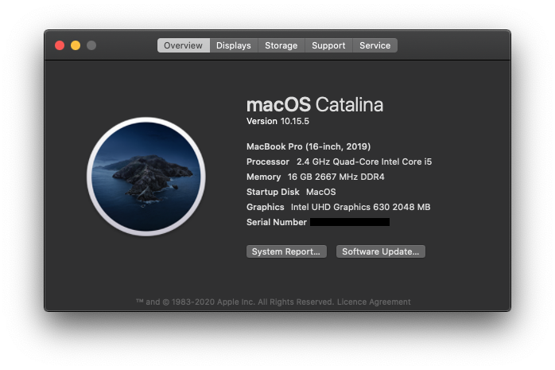
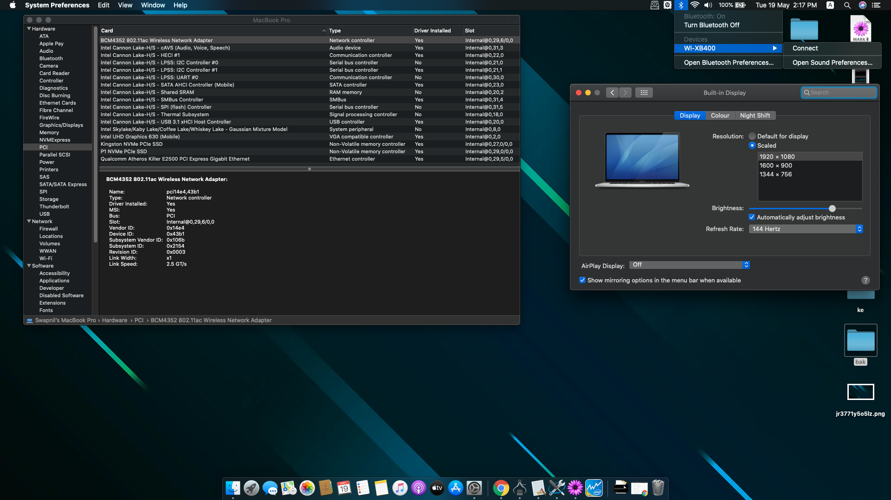
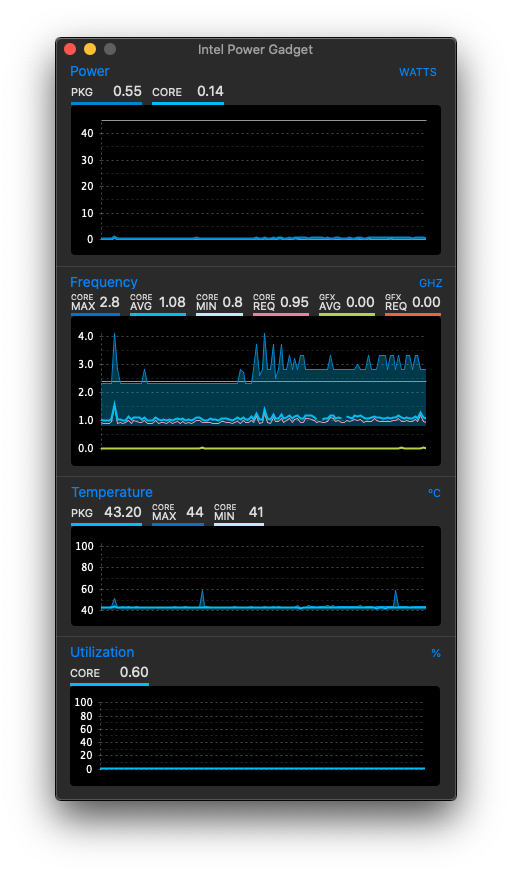

# Acer Nitro 7-AN715-51-OpenCore-Hackintosh

**macOS Version: 10.15.5 19F96**

**OpenCore Version: [0.5.8 Offical](https://github.com/acidanthera/OpenCorePkg/releases/tag/0.5.8)**

MacOS on ACER NITRO 7 

 MacOS Catalina 10.15.5
 :-------------------------:
 
 
 
 ## Updates
- 2020-05-19:

  Initial release .

 ## Guide
 
 * Bios Unlock [GUIDE](https://www.win-raid.com/t6175f54-Request-Unlocking-the-advanced-and-overclocking-menu-ACER-NITRO-AN.html)
 * Go to [GUIDE](https://dortania.github.io/vanilla-laptop-guide/)(**Official Guide**)
 * [OC-Little](https://github.com/daliansky/OC-little) - (**By daliansky**)
 (https://oc.skk.moe/2-configuration.html)

 ## ## System Information 💻
 
 | Part | Functional | Model | 
 | --- | --- | --- |
 | Machine | ✅ | Acer Nitro 7 AN715-51 |
 | BIOS | ✅ | 1.29 Insyde-Unlocked |
 | CPU | ✅ | Intel(R) Core(TM) i5-9300H CPU @ 2.40GHz |
 | RAM | ✅ | 16GB DDR4 2666GHz SODIMM |
 | SSD | ✅ | 256GB Kingston NVMe(MacOS) + 1TB Crucial P1 NVMe(Windows 10) + 2TB Seagate HDD |
 | iGPU | ✅ | Intel UHD Graphics 630 1536 MB |
 | WLAN | ✅ | DW1560/Broadcom BCM94352Z NGFF 802.11AC BT 4.0 Card |
 | Bluetooth | ✅ | Broadcom 20702 Bluetooth 4.0 |
 | Ethernet | ✅ | Qualcomm/Atheros E2500 PCI-E Gigabit Ethernet |
 | Webcam | ✅ | Integrated 720P Webcam |
 | Audio | ✅ | Realtek HDA ALC255 |
 | Microphone | 🚫 | Integrated Microphone |
 | Internal Screen | ✅ | LG LP156WFG-SPF3 15.6' 1920x1080 144Hz |
 | Trackpad | ✅ | I2C ELAN0504 |
 | Keyboard | ✅ | - |
 | dGPU | 🚫 | NVIDIA GTX 1660ti 6GB GDDR6 |
 
## Perfectly Working Features

- [x] Native Hardware NVRAM
- [x] Intel UHD630
- [x] Screen Brightness Control
- [x] Screen Brightness Memoriztion After Reboot
- [x] Native Screen Refresh Rate Settings
- [x] USB 3.1 Gen 1
- [x] Web Camera
- [x] Battery Percentage
- [x] Sleep & Wake
- [x] Sensors
- [x] CPU turbo boost
- [x] Trackpad
- [x] Fn Keys
- [x] Siri
- [x] USB Sidecar
- [x] ...

> 1. The above functions are only tested and passed in AN715-51.
> 1. Whether the native refresh rate adjustment is available depends on the model and production batch of the screen.
> 1. HIDPI needs to be opened with additional tools.(needs more testing)
> 1. SMBIOS selected to `MacBook Pro 16,1` and `MacBook Pro 15,3`, will have less sensor information than `MacBook Pro 15,1`.
> 1. Non- AN715-51 requires separate custom USBPorts.kext to activate keyboard and fix sleep issues.
 
 
 ## ## Issues & Solutions
 ### macOS
 * [Hackintool: The Swiss army knife of vanilla Hackintoshing.](https://github.com/headkaze/Hackintool)
 * [How to download a full ‘Install macOS’ app with software update in TERMINAL](https://scriptingosx.com/2019/10/download-a-full-install-macos-app-with-softwareupdate-in-catalina/)
 
 ## Generate your own SMbios

   Platforminfo

   For setting up the SMBIOS info, we'll use CorpNewt's GenSMBIOS and ProperTree application. https://github.com/corpnewt/GenSMBIOS https://github.com/corpnewt/ProperTree

   Because of the Coffee Lake Plus(9th Gen), we'll choose the MacBookPro16,1 SMBIOS:

   Run GenSMBIOS, pick option 1 for downloading MacSerial and Option 3 for selecting out SMBIOS. This will give us an output similar to the following:

   Type: MacBookPro16,1

   Serial: C02WXAY2HV2N

   Board Serial: C02826303CDHRPC8C

   SmUUID: 88AA1336-8DF9-477A-A39F-03D016ED0809

   The order is Product | Serial | Board Serial (MLB)

   The Type part gets copied to Generic -> SystemProductName.

   The Serial part gets copied to Generic -> SystemSerialNumber.

   The Board Serial part gets copied to Generic -> MLB.

   The SmUUID part gets copied toto Generic -> SystemUUID.

   We set Generic -> ROM to either an Apple ROM (dumped from a real Mac), your NIC MAC address, or any random MAC address (could be just 6 random bytes, for this guide we'll use 11223300 0000. After install follow the Fixing iServices page on how to find your real MAC Address)

   Reminder that you want either an invalid serial or valid serial numbers but those not in use, you want to get a message back like: "Invalid Serial" or "Purchase Date not Validated"

   Apple Check Coverage page https://checkcoverage.apple.com/cn/zh/
   
### Monitor
* [[https://software.intel.com/en-us/articles/intel-power-gadget][Intel® Power Gadget]]
* [[https://download.developer.apple.com/Developer_Tools/Additional_Tools_for_Xcode_11/Additional_Tools_for_Xcode_11.dmg][IO Registry Explorer]]
* [[https://bjango.com/mac/istatmenus/][iStat Menus]]
* [[https://github.com/kozlek/HWSensors][HWSensors]]

### NTFS Writer
* [[http://enjoygineering.com/mounty/][Mounty]]
 
 ### Audio
 * KEXT required to enable Audio support : `AppleALC.kext`
 * Make sure you inject audio `layout-id = 29 or 71` in OpenCore , using layout-id = 3 may get distorted audio. (Microphone doesn't work yet- Working on a custom layout-id)
 * Please share if you find out other working `layout-id`!
 
 ### ELAN Trackpad (TPAD)
 * The new official I2C kexts are having some issues with wake/sleep .
 * For now use custom I2C kexts by @tiger511 .
 * Will get updated once the issues are fixed . 
 
 ### Wifi & Bluetooth
 * In order to get Bluetooth and Wifi working, a wireless card replacement is needed.
 * I replaced mine with BCM94352Z/DW1560 - got it from aliexpress .
 * For now, the best card to use is BCM94360CS2 using a NGFF adapter which you can buy on eBay under $10. It has the highest performance among all other hackintosh-able wireless cards. It is natively supported in OpenCore (v2.X and above).
 
 ### GPU
 ##### iGPU
 * Remove `enable-dpcd-max-link-rate-fix` and `enable-dpcd-max-link-rate-fix` from config.plist-DeviceProperties if you've a normal 60hz display .
 * UHD 630 is supported from 2.X and above.
 * Some times UHD 630 glichs on the internal screen , maybe because of my 144hz display.
 * HDMI Port :
    * Long story short, it won't work. Why? Because all display output is hard wired to the NVIDIA GPU. You can confirm this by going into NVIDIA controler panel in Windows and see PhysX, and you can see all display output is wired to the NVIDIA card, while the eDP in screen display is wired to the iGPU. Therefore, since NVIDIA card won't work, also Optimus won't work, the HDMI port or USB-C display output just won't work because the display output is not wired to the iGPU. Not to mention you disabled dGPU in `config.plist/-wegnoegpu`or custom `SSDT-DDGPU`.	
 ##### dGPU
 * NVIDIA GTX1660ti is not supported and is disabled with SSDT-DDGPU.
 * [Apple and Nvidia Are Over: NVIDIA drops CUDA support for macOS.](https://gizmodo.com/apple-and-nvidia-are-over-1840015246)
 * Currently, there is nothing we can do. Let's hope Apple and NVIDIA work together again. 
 
 ### Power Management
 * On idle laptop uses 0.50w to 0.60w - stable for me.
   [CPUFriendFriend](https://github.com/corpnewt/CPUFriendFriend) In order for macOS to effectively manage the power profile of the i5-9300H processor in the Nitro model used here, it is necessary to include a powermanagement profile for X86PlatformPlugin.
 
   A pre-built `CPUFriend.kext` and `CPUFriendDataProvider.kext` is included in the `kext` folder for the i5-9300H.

   Instructions on how to build a power mangaement profile for any other CPU types can be found here:

   https://github.com/PMheart/CPUFriend/blob/master/Instructions.md
   
 * using custom SSDT-DDGPU fixes power sapping issues .
 
 Intel Power Gadget
 :-------------------------:
 
 
 ### Time Sync
 * Since macOS take BIOS time as UTC time, and Windows take it as local time, we need to make Windows take BIOS time as UTC time.
 #+BEGIN_SRC ps
   sudo Reg add HKLM\SYSTEM\CurrentControlSet\Control\TimeZoneInformation /v RealTimeIsUniversal /t REG_DWORD /d 1
 #+END_SRC
 
## Credits

- [acidanthera](https://github.com/acidanthera) for providing almost all kexts and drivers
- [alexandred](https://github.com/alexandred) for providing VoodooI2C
- [headkaze](https://github.com/headkaze) for providing the very useful [Hackintool](https://www.tonymacx86.com/threads/release-hackintool-v2-8-6.254559/)
- [daliansky](https://github.com/daliansky) for providing the awesome hotpatch guide [OC-little](https://github.com/daliansky/OC-little/) and the always up-to-date hackintosh solutions [XiaoMi-Pro-Hackintosh](https://github.com/daliansky/XiaoMi-Pro-Hackintosh) [黑果小兵的部落阁](https://blog.daliansky.net/)
- [RehabMan](https://github.com/RehabMan) for providing numbers of [hotpatches](https://github.com/RehabMan/OS-X-Clover-Laptop-Config/tree/master/hotpatch) and hotpatch guides
- [tiger511](https://github.com/tiger511) for custom I2C kexts
- [corpnewt](https://github.com/corpnewt/CPUFriendFriend) for CPUFriendFriend
- And all other authors that mentioned or not mentioned in this repo
 
 ## License
 * This work is issued under the [996 License](https://github.com/996icu/996.ICU/blob/master/LICENSE) and [MIT License](https://opensource.org/licenses/MIT).